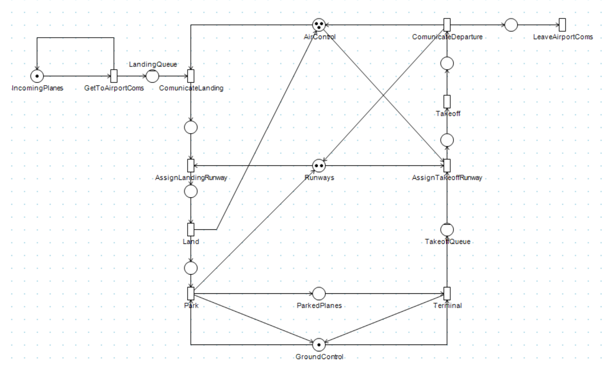
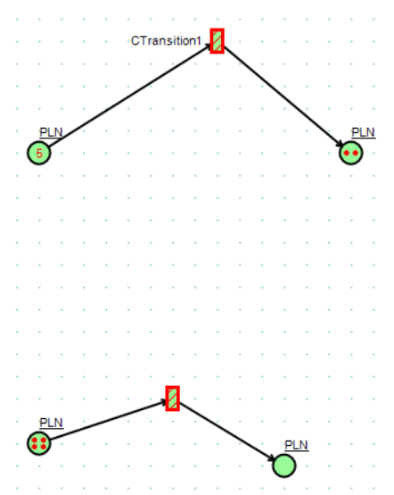
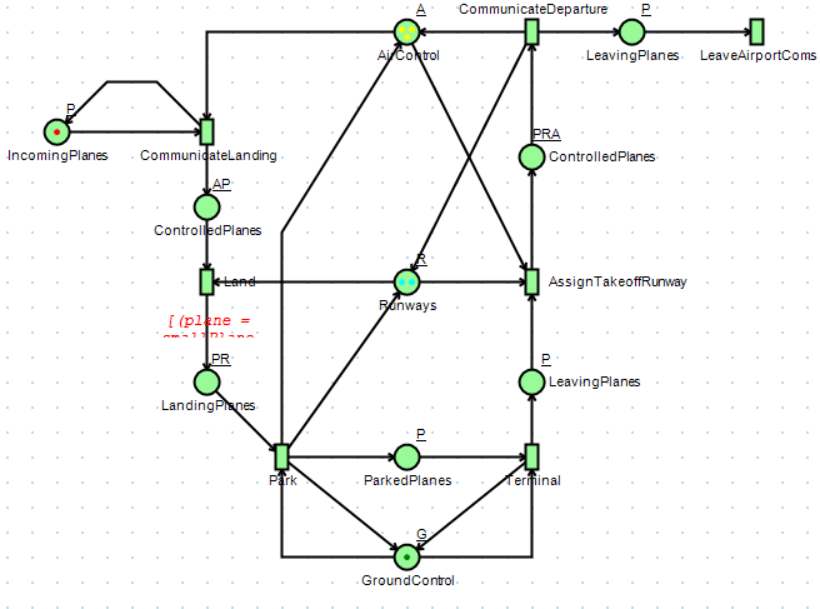

# Task

topic: Colored Petri Nets or TLA+/PlusCal

deadline: 12.2.2023

note: you can use either Colored Petri Nets or TLA+/PlusCal (if you are brave)

task 1: create model for air traffic control system at middle-sized international airport (Ruzyne, Vienna)
	- you should capture the following: main control tower, multiple runways (at least 2), several airplanes (take-off, descent), input from radar, communication between the control tower and some airplanes

task 2: document your solution
	- explain key overall design decisions

resources for "air traffic control"
	https://en.wikipedia.org/wiki/Air_traffic_control
	https://science.howstuffworks.com/transport/flight/modern/air-traffic-control.htm
	https://www.caa.co.uk/consumers/guide-to-aviation/how-air-traffic-control-works/

# Solution

I have chosen to create a model of simple air traffic control system using PetriDotNet. Solution `AirportCPN` can be openeded using [PetriDotNet](http://inf.mit.bme.hu/en/research/tools/petridotnet) tool. 

I have used https://www.caa.co.uk/consumers/guide-to-aviation/how-air-traffic-control-works/ description as an inspiration. Main points were that a plane joins a telecomunication channel and then waits for a permission to land. After landing it gets handled by the ground personell and gets parked or loaded immediately and then it waits for a permission to take off. When its taken off it departs and does not communicate with the tower anymore.

The net consists of four main loops. One is for the planes, where they come form a loop on the left side which represents incoming planes. The plane then proceeds to communication with the Air Control Tower where its guided by *Air Control* to its landing. When landed *Air Control* forwards the plane to *Ground Control* where it is guided to the parking lot. Any *Parked Plane* can depart to terminal via *Ground Control* and proceed to take-off when *Air Control* accepts them and gives the green light.

The second loop is for *AirControl* which is responsible for the communication with the planes. It is responsible for the take-off and landing of the planes. Personell represented by tokens takes care of the whole landing/take-off process and then is ready to accept another plane.

Third loop is for *Ground Control* which is responsible for the communication with the planes on the ground.  Simillarly to *Air Control*, it is responsible for parking and departure of planes. Personell represented by tokens takes care of the whole parking/departure process and then is ready to accept another plane.

There is aditional loop and type of token for *Runways*, this type of token represents wether ther is an empty runway.

Above mentioned types (*AirControl*, *GroundControl*, *Runway*, *Planes*) are represented by tokens. We could use different colors for each type, but as I have figured out after a few hours PetriDotNet for colored nets does not work. However we can see that different types are not necessary as each type has its own loop and tokens can not get mixed up. I have modified the net a little bit and made it colored. This approach is described below together with example situation of how is PetriDotNet broken for colored nets.

--- 

I have tried simulating the run for a while and planes got stuck at landing and departure queue, therefore I have decided to limit number of tokens in such places.

---

---

I have modified the above described net a little bit. Mostly removed nodes which were not necessary. I planned to introduce size for planes and runways and differentiate which plane uses which runway. However I later found out that colored nets do not work at all. We can see in `NotWorking.pnml` example that the top net moves tokens even though when running the simulation it should not and the transition node is marked as unusable. The bottom net is the same as the top one, but without any explicit guards or arc expressions. I have figured out that once we put anything to the arc expressions (even a line-feed) the transition will always go through no matter wether it should or not. On the following picture the top net is the one with explicit guards (shows that it wont run, but it runs, and it should show that it will run) and the bottom one is the one without any guards (shows that it wont run, it does not run, but we should be able to run it).

> Note that the issue to make the nets incorectly run using guards might require to rewrite the guards to work.

This is the colored CPN:

